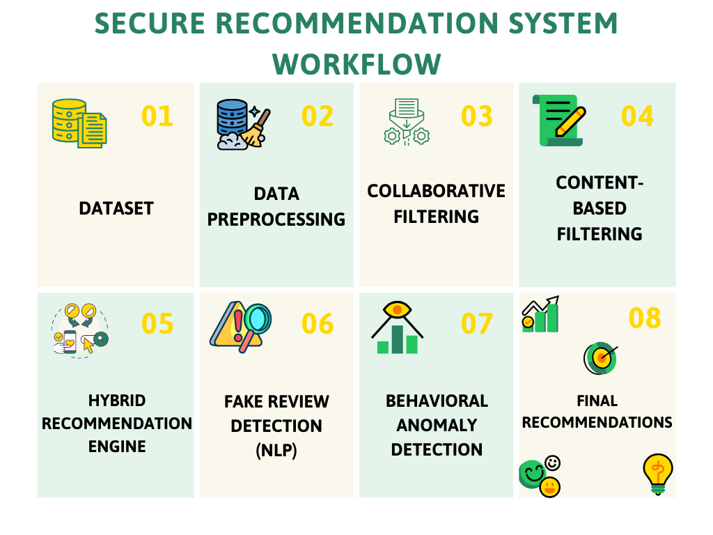

# 🏠 Secure Hybrid Recommendation System

> An intelligent Airbnb listing recommendation system that combines collaborative filtering and content-based approaches with enhanced security features to provide personalized and trustworthy accommodation suggestions.

## 📋 Table of Contents

- [Overview](#overview)
- [Features](#features)
- [System Architecture](#system-architecture)
- [Technologies](#technologies)
- [Installation](#installation)
- [Usage](#usage)
- [Dataset](#dataset)
- [Methodology](#methodology)
- [Roadmap](#roadmap)
- [Contributing](#contributing)
- [License](#license)

## 🎯 Overview

This project implements a **hybrid recommendation system** for Airbnb listings that addresses the challenge of helping users find the perfect accommodation among thousands of options. By combining multiple recommendation techniques, the system provides more accurate and personalized suggestions while incorporating security measures to protect user data and prevent manipulation.

### Why Hybrid?

- **Collaborative Filtering**: Leverages user behavior patterns and ratings to find similar users and their preferences
- **Content-Based Filtering**: Analyzes listing attributes (location, amenities, price, reviews) to match user preferences
- **Hybrid Approach**: Combines both methods to overcome individual limitations and provide robust recommendations

### Why Secure?

- Prevention of fake reviews and rating manipulation
- Detection of suspicious review behavior
- Trust-aware recommendation mechanisms
- Malicious behavior and anomaly detection
- Improved reliability of personalized recommendations
  
## ✨ Features

### Current Features
- [ ] Data collection and preprocessing pipeline
- [ ] Exploratory data analysis of Airbnb listings
- [ ] Basic collaborative filtering implementation
- [ ] Content-based filtering using listing features
- [ ] Hybrid model combining both approaches

### Planned Features
- [ ] User authentication and secure session management
- [ ] Real-time recommendation generation
- [ ] Interactive web interface
- [ ] A/B testing framework
- [ ] Performance metrics dashboard
- [ ] Anti-fraud detection mechanisms

## 🏗️ System Architecture

```text
## 📌 Secure Recommendation System Workflow


```

## 🛠️ Technologies

### Core Technologies (Planned)
```python
tech_stack = {
    "Language": "Python 3.8+",
    "Data Processing": ["Pandas", "NumPy"],
    "Machine Learning": ["Scikit-learn", "Surprise"],
    "Visualization": ["Matplotlib", "Seaborn", "Plotly"],
    "Security & Analytics": [
    "Anomaly Detection",
    "NLP-based Review Analysis"],
    "Web Framework": ["Flask", "Streamlit"],
    "Database": ["PostgreSQL", "MongoDB"]
}
```

### Libraries & Tools
- **pandas** - Data manipulation and analysis
- **numpy** - Numerical computing
- **scikit-learn** - Machine learning algorithms
- **surprise** - Recommendation system library
- **matplotlib/seaborn** - Data visualization
- **Flask/Streamlit** - Web interface
- **pytest** - Testing framework

## 🚀 Installation

### Prerequisites
- Python 3.8 or higher
- pip package manager
- Virtual environment (recommended)

### Setup Instructions

```bash
# Clone the repository
git clone https://github.com/insights-by-bahuleya/secure-hybrid-recommendation-system.git
cd secure-hybrid-recommendation-system

# Create virtual environment
python -m venv venv
source venv/bin/activate  # On Windows: venv\Scripts\activate

# Install dependencies
pip install -r requirements.txt

# Run the application
jupyter notebook
```

## 💻 Usage

```python
# Example usage (coming soon)
from recommender import HybridRecommender

# Initialize the recommender
recommender = HybridRecommender()

# Load data
recommender.load_data('data/airbnb_listings.csv')

# Train the model
recommender.train()

# Get recommendations for a user
recommendations = recommender.get_recommendations(user_id=123, n=10)

# Display results
for listing in recommendations:
    print(f"{listing['name']} - Score: {listing['score']}")
```

## 📊 Dataset

### Data Sources
- **Airbnb Open Data**: Public datasets from Inside Airbnb
- **User Interactions**: Simulated user ratings and interactions for testing

### Data Features
- **Listing Information**: Location, property type, amenities, price
- **Host Details**: Verification status, response rate, reviews
- **Reviews & Ratings**: User ratings, review text, sentiment scores
- **Availability**: Calendar data, booking patterns

### Data Statistics (To be updated)
```
Total Listings: TBD
Total Users: TBD
Total Interactions: TBD
Date Range: TBD
```

## 🔬 Methodology

### 1. Data Preprocessing
- Handle missing values
- Feature engineering (extract location, amenity features)
- Text processing for reviews (sentiment analysis)
- Normalize numerical features

### 2. Collaborative Filtering
- **User-Based**: Find similar users based on rating patterns
- **Item-Based**: Find similar listings based on user interactions
- **Matrix Factorization**: SVD/ALS for latent factor models

### 3. Content-Based Filtering
- Feature extraction from listing attributes
- TF-IDF for text features (descriptions, reviews)
- Cosine similarity for matching user preferences

### 4. Hybrid Model
- **Weighted Hybrid**: Combine scores from both approaches
- **Switching Hybrid**: Choose method based on data availability
- **Feature Combination**: Use collaborative features in content model

### 5. Security Measures

- Fake review detection using NLP
- Behavioral anomaly detection
- Detection of suspicious rating activity
- Trust-aware recommendation scoring
  
## 🗺️ Roadmap

### Phase 1: Foundation 
- [ ] Project setup and documentation
- [ ] Data collection and exploration
- [ ] Basic EDA and visualization
- [ ] Data preprocessing pipeline

### Phase 2: Core Development
- [ ] Implement collaborative filtering
- [ ] Implement content-based filtering
- [ ] Combine into hybrid model
- [ ] Evaluation metrics and testing

### Phase 3: Enhancement
- [ ] Add security features
- [ ] Build web interface
- [ ] Integrate real-time recommendations
- [ ] Performance optimization

### Phase 4: Deployment
- [ ] Model deployment
- [ ] Documentation and tutorials
- [ ] User testing and feedback
- [ ] Final optimizations

## 📈 Performance Metrics

The system will be evaluated using:
- **RMSE** (Root Mean Square Error)
- **MAE** (Mean Absolute Error)
- **Precision@K** and **Recall@K**
- **Coverage** - Percentage of items recommended
- **Diversity** - Variety in recommendations
- **Novelty** - Ability to suggest unexpected items

## 🤝 Contributing

Contributions are welcome! Here's how you can help:

1. Fork the repository
2. Create a feature branch (`git checkout -b feature/AmazingFeature`)
3. Commit your changes (`git commit -m 'Add some AmazingFeature'`)
4. Push to the branch (`git push origin feature/AmazingFeature`)
5. Open a Pull Request

## 📝 License

This project is licensed under the MIT License - see the [LICENSE](LICENSE) file for details.

## 👤 Author

**Bahuleya**
- GitHub: [@insights-by-bahuleya](https://github.com/insights-by-bahuleya)
- Project Link: [Secure Hybrid Recommendation System](https://github.com/insights-by-bahuleya/secure-hybrid-recommendation-system)

## 🙏 Acknowledgments

- Inside Airbnb for providing open data
- Scikit-learn and Surprise library documentation
- Research papers on hybrid recommendation systems
- The open-source community

---

<div align="center">

### ⭐ Star this repo if you find it helpful!


**Learning in Public | Building in the Open**

</div>
